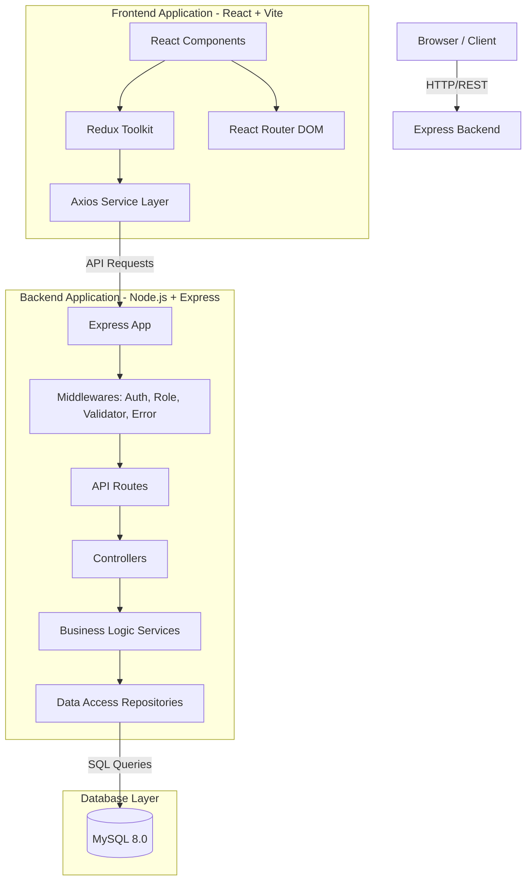
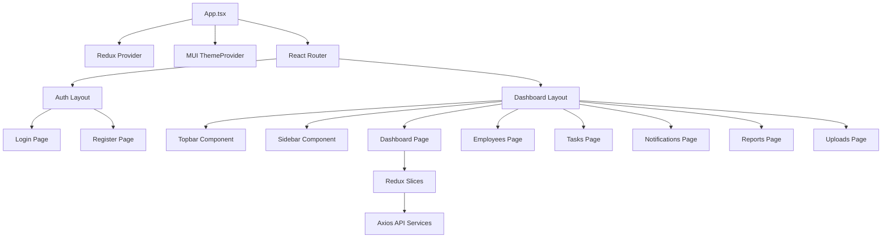
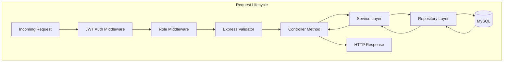

# System Architecture

## 1. Overall System Architecture


## 2. Frontend Architecture


## 3. Backend Layer Diagram


## 4. Folder Architecture Tree
```text
/
├── backend/
│   ├── package.json
│   ├── src/
│   │   ├── app.ts                  # Express setup
│   │   ├── server.ts               # Server entry point
│   │   ├── config/                 # Environment configs
│   │   ├── controllers/            # Route controllers
│   │   ├── database/               # MySQL connection pool
│   │   ├── dtos/                   # Data Transfer Objects
│   │   ├── middlewares/            # Auth, Validation, Error handlers
│   │   ├── repositories/           # Database queries
│   │   ├── routes/                 # Express router setup
│   │   ├── services/               # Business logic
│   │   ├── utils/                  # Helpers (JWT, Pagination, Logger)
│   │   └── validators/             # Express-validator schemas
│   └── uploads/                    # Local file storage
├── frontend/
│   ├── package.json
│   ├── index.html
│   ├── vite.config.ts
│   ├── src/
│   │   ├── App.tsx                 # Main React component
│   │   ├── main.tsx                # React DOM render
│   │   ├── components/             # Reusable UI components
│   │   ├── constants/              # App constants
│   │   ├── layout/                 # Page layouts (Sidebar, Topbar)
│   │   ├── pages/                  # Route components
│   │   ├── routes/                 # Router configuration
│   │   ├── services/               # Axios API clients
│   │   ├── store/                  # Redux store & slices
│   │   ├── styles/                 # MUI Theme configuration
│   │   └── utils/                  # Helper functions
└── schema.sql                      # Database schema
```
