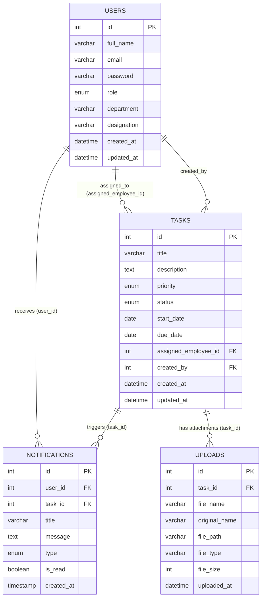

# Database Documentation

## 1. Entity Relationship (ER) Diagram

---

## 2. Table Definitions & Constraints

### 2.1 `users` Table
**Purpose:** Stores all organizational members, acting as the central authentication and identity entity. It dictates permissions through the `role` column.

| Column | Data Type | Constraints | Description |
| :--- | :--- | :--- | :--- |
| `id` | INT | PRIMARY KEY, AUTO_INCREMENT | Unique identifier for the user. |
| `full_name` | VARCHAR(255) | NOT NULL | Employee's full display name. |
| `email` | VARCHAR(255) | NOT NULL, UNIQUE | Used for login authentication. |
| `password` | VARCHAR(255) | NOT NULL | Bcrypt hashed password. |
| `role` | ENUM | 'ADMIN', 'EMPLOYEE' | RBAC control field. |
| `department` | VARCHAR(100) | NULL | Organizational department. |
| `designation` | VARCHAR(100) | NULL | Job title. |
| `created_at` | DATETIME | DEFAULT CURRENT_TIMESTAMP | Record creation timestamp. |
| `updated_at` | DATETIME | DEFAULT CURRENT_TIMESTAMP ON UPDATE | Record modification timestamp. |

**Indexes:**
- `idx_email` on `email` (Speeds up login lookups and ensures uniqueness).

---

### 2.2 `tasks` Table
**Purpose:** The core entity of the application. Tracks units of work, their deadlines, and their execution state.

| Column | Data Type | Constraints | Description |
| :--- | :--- | :--- | :--- |
| `id` | INT | PRIMARY KEY, AUTO_INCREMENT | Unique identifier for the task. |
| `title` | VARCHAR(255) | NOT NULL | Short summary of the task. |
| `description` | TEXT | NULL | Detailed instructions. |
| `priority` | ENUM | 'LOW', 'MEDIUM', 'HIGH' | Urgency level. |
| `status` | ENUM | 'PENDING', 'IN_PROGRESS', 'COMPLETED' | Current execution state. |
| `start_date` | DATE | NOT NULL | When the task begins. |
| `due_date` | DATE | NOT NULL | Deadline. Must be >= start_date. |
| `assigned_employee_id` | INT | FOREIGN KEY | References `users.id`. |
| `created_by` | INT | FOREIGN KEY | References `users.id` (Admin). |
| `created_at` | DATETIME | DEFAULT CURRENT_TIMESTAMP | Task creation time. |
| `updated_at` | DATETIME | DEFAULT CURRENT_TIMESTAMP ON UPDATE | Last modification time. |

**Foreign Keys:**
- `FK_tasks_assignee`: `assigned_employee_id` -> `users(id)` ON DELETE SET NULL.
- `FK_tasks_creator`: `created_by` -> `users(id)` ON DELETE SET NULL.

**Indexes:**
- `idx_assigned_employee` on `assigned_employee_id` (Speeds up employee dashboard queries).
- `idx_status` on `status` (Speeds up status filtering and report generation).
- `idx_due_date` on `due_date` (Speeds up overdue/upcoming deadline queries).

---

### 2.3 `notifications` Table
**Purpose:** Facilitates asynchronous alerting for employees when new tasks are assigned, completed, or approaching deadlines.

| Column | Data Type | Constraints | Description |
| :--- | :--- | :--- | :--- |
| `id` | INT | PRIMARY KEY, AUTO_INCREMENT | Unique identifier. |
| `user_id` | INT | FOREIGN KEY, NOT NULL | References `users.id`. |
| `task_id` | INT | FOREIGN KEY, NULL | References `tasks.id`. |
| `title` | VARCHAR(255) | NULL | Short notification header. |
| `message` | TEXT | NOT NULL | Detailed alert body. |
| `type` | ENUM | 'TASK_ASSIGNED', 'TASK_COMPLETED', 'TASK_DUE' | Notification categorization. |
| `is_read` | BOOLEAN | DEFAULT 0 | Tracks acknowledgment. |
| `created_at` | TIMESTAMP | DEFAULT CURRENT_TIMESTAMP | Time the alert was fired. |

**Foreign Keys:**
- `FK_notifications_user`: `user_id` -> `users(id)` ON DELETE CASCADE.
- `FK_notifications_task`: `task_id` -> `tasks(id)` ON DELETE CASCADE.

**Indexes:**
- `idx_user_unread`: Compound index on `(user_id, is_read)` (Optimizes fetching unread badges).

---

### 2.4 `uploads` Table
**Purpose:** Acts as a metadata registry for files physically stored on the server disk. Links file attachments directly to specific tasks.

| Column | Data Type | Constraints | Description |
| :--- | :--- | :--- | :--- |
| `id` | INT | PRIMARY KEY, AUTO_INCREMENT | Unique identifier. |
| `task_id` | INT | FOREIGN KEY, NOT NULL | References `tasks.id`. |
| `file_name` | VARCHAR(255) | NOT NULL, UNIQUE | Server-side generated safe name. |
| `original_name`| VARCHAR(255) | NOT NULL | Original file name from client. |
| `file_path` | VARCHAR(500) | NOT NULL | Absolute or relative disk path. |
| `file_type` | VARCHAR(100) | NOT NULL | e.g., 'application/pdf'. |
| `file_size` | INT | NOT NULL | File size in bytes. |
| `uploaded_at` | DATETIME | DEFAULT CURRENT_TIMESTAMP | Time of upload. |

**Foreign Keys:**
- `FK_uploads_task`: `task_id` -> `tasks(id)` ON DELETE CASCADE.

---

## 3. Database Normalization & Design Principles

The database follows **3rd Normal Form (3NF)**:
1. **1NF (Atomic Values):** All columns contain singular, atomic values. E.g., multiple attachments are stored in separate rows in the `uploads` table, linked by `task_id`, not as a comma-separated list.
2. **2NF (No Partial Dependencies):** Every table has a single integer Primary Key. All non-key attributes depend entirely on that PK.
3. **3NF (No Transitive Dependencies):** No non-key column depends on another non-key column. Employee names are not stored in the `tasks` table; instead, a foreign key `assigned_employee_id` is used to JOIN the `users` table dynamically on read.

## 4. Data Flow Architecture

1. **Authentication:** 
   - A client posts credentials. The system queries the `users` table utilizing the `idx_email` index. Upon success, a JWT is formed.
2. **Task Assignment & File Attachments:** 
   - When an Admin creates a task, a record is inserted into `tasks`. Files uploaded with the task are inserted into `uploads` referencing the new `task_id`. A database trigger (or service layer logic) subsequently inserts a row into the `notifications` table assigned to the `assigned_employee_id` and linked to the `task_id`.
3. **Dashboard Aggregation:** 
   - When an employee loads their dashboard, the system executes heavy aggregate functions (`COUNT(*)`) filtering on `assigned_employee_id` and `status` via optimized indexes to calculate "My Tasks" and "Pending Tasks" swiftly.
4. **Cascade Deletions:** 
   - If a task is deleted, its associated `notifications` and `uploads` metadata are automatically purged via `ON DELETE CASCADE`. If a user is deleted, their tasks are typically retained with a `SET NULL` on the foreign key to preserve company history and audit trails.
