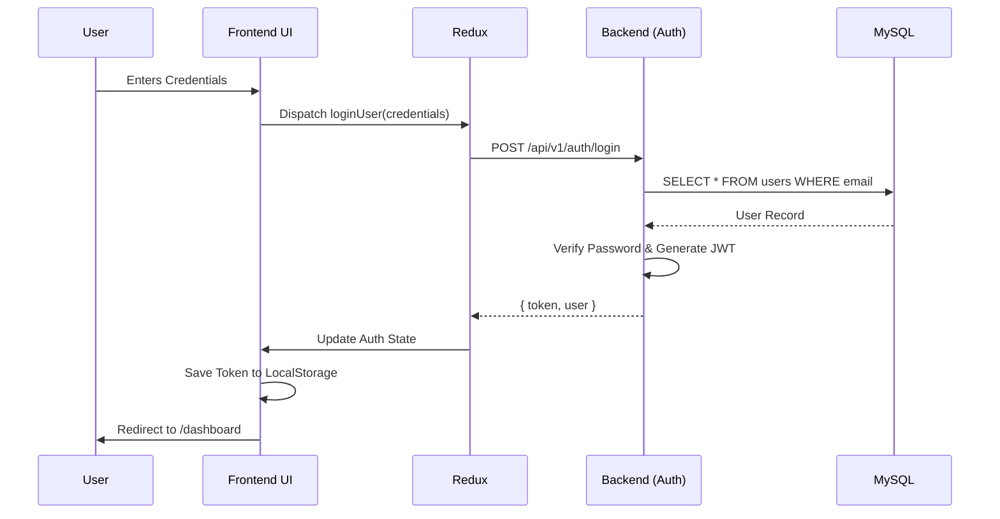
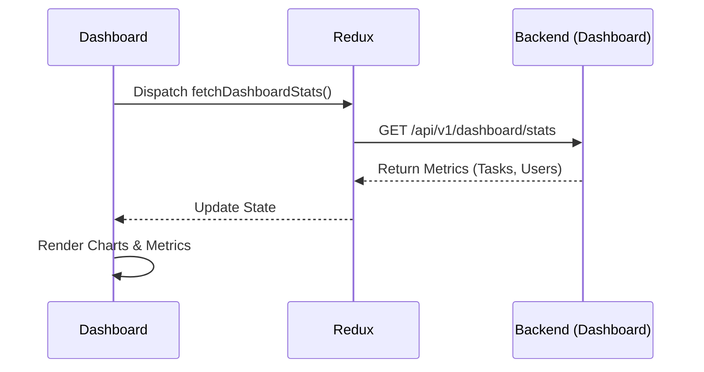
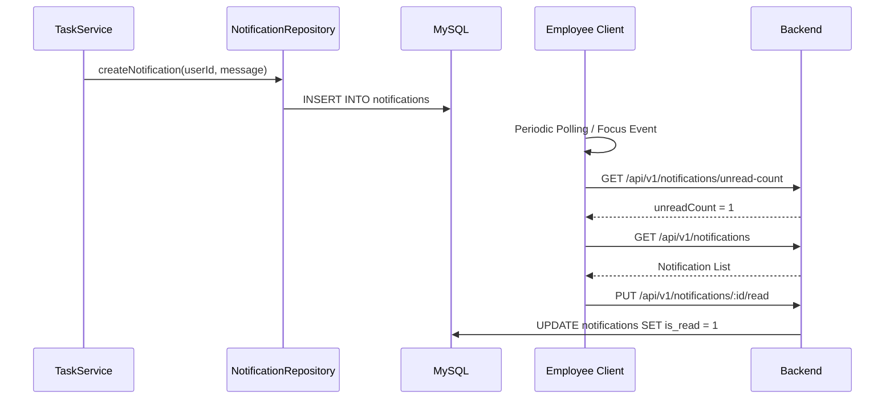
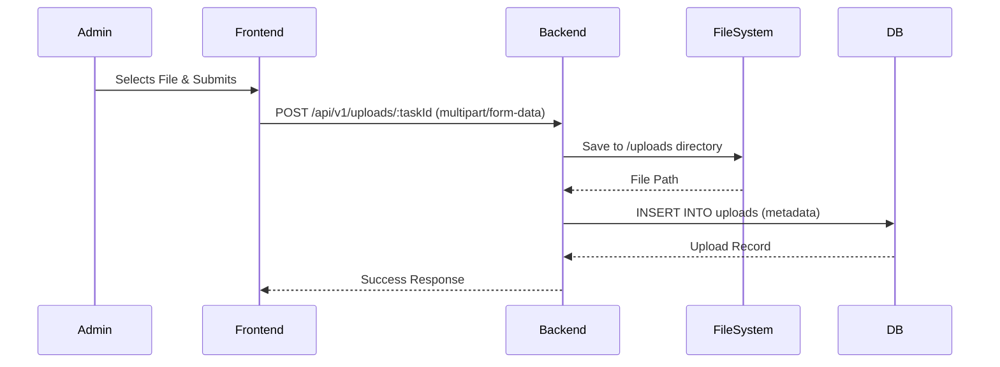
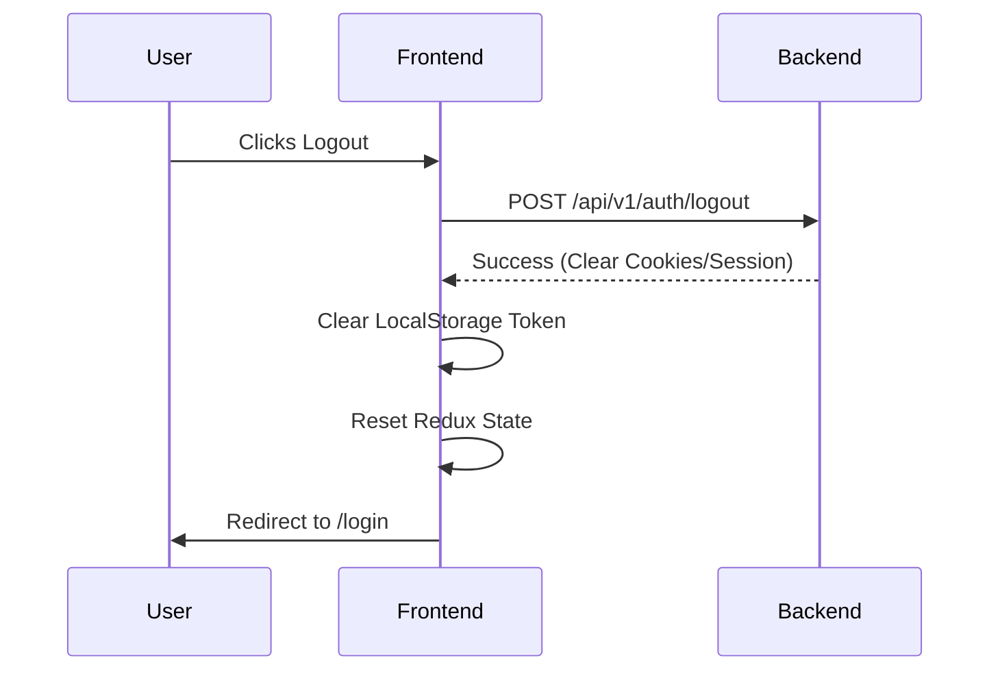

# Application Flow Diagrams

## 1. Authentication Flow


## 2. Dashboard Loading Flow


## 3. Employee Management Flow
```mermaid
graph TD
    A[Admin navigates to /employees] --> B[Dispatch fetchEmployees()]
    B --> C[GET /api/v1/users]
    C --> D[Render DataGrid]
    
    D --> E{Action}
    E -->|Create| F[Open EmployeeFormDialog]
    F --> G[Submit Form]
    G --> H[POST /api/v1/users]
    
    E -->|Edit| I[Open EmployeeFormDialog]
    I --> J[Submit Form]
    J --> K[PUT /api/v1/users/:id]
    
    E -->|Delete| L[Open DeleteDialog]
    L --> M[Confirm Delete]
    M --> N[DELETE /api/v1/users/:id]
    
    H --> B
    K --> B
    N --> B
```

## 4. Task Management Flow
```mermaid
graph TD
    A[User navigates to /tasks] --> B[Dispatch fetchTasks()]
    B --> C[GET /api/v1/tasks]
    C --> D[Render Task List]
    
    D --> E{Action}
    E -->|Create Task| F[POST /api/v1/tasks]
    F --> G[Task Created in DB]
    G --> H[Trigger Notification via TaskService]
    
    E -->|Update Status| I[PUT /api/v1/tasks/:id]
    I --> J[Validate Rules (e.g. Completed tasks immutable)]
    J --> K[Task Updated in DB]
    K --> L[Trigger Status Notification]
```

## 5. Notification Flow


## 6. Uploads Flow


## 7. Logout Flow

