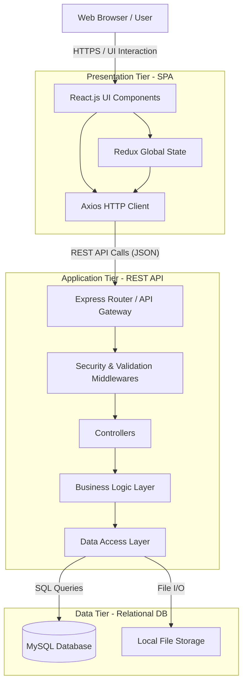

# High-Level Architecture (HLA)

## 1. Executive Summary
The Employee Task Management System follows a classic **3-Tier Architecture**, decoupling the presentation layer (Frontend), business logic layer (Backend API), and data persistence layer (Database). This separation of concerns ensures scalability, maintainability, and security across enterprise HRMS operations.

## 2. Technology Stack
- **Frontend Layer:** React 19, Vite, Redux Toolkit (State Management), Material UI (Component Library), React Router DOM (Routing), Zod (Client-side Validation).
- **Backend Layer:** Node.js, Express.js (REST API framework), express-validator (Server-side Validation), JSON Web Tokens (Authentication).
- **Database Layer:** MySQL 8.0, accessed via `mysql2/promise` using raw SQL queries for optimized performance.

## 3. High-Level Architecture Diagram

## 4. Subsystem Overviews

### A. Presentation Tier (Frontend)
A Single Page Application (SPA) built with Vite and React. It utilizes Redux Toolkit for centralized state management, keeping local component state to a minimum. The UI is constructed strictly with Material UI (MUI) components, ensuring a cohesive, enterprise-grade design system.

### B. Application Tier (Backend)
An Express.js RESTful API structured around the **Controller-Service-Repository** design pattern:
- **Routes:** Maps HTTP verbs and endpoints to specific controllers.
- **Controllers:** Handle HTTP request/response lifecycles and extract payloads.
- **Services:** Contain pure business logic and transactional workflows.
- **Repositories:** Abstract all raw database interactions (SQL).

### C. Data Tier (Database)
A relational MySQL database enforcing strict data integrity through Foreign Keys, constraints, and optimized indexing. Local server storage is utilized for file uploads, with metadata tracked relationally within MySQL.
