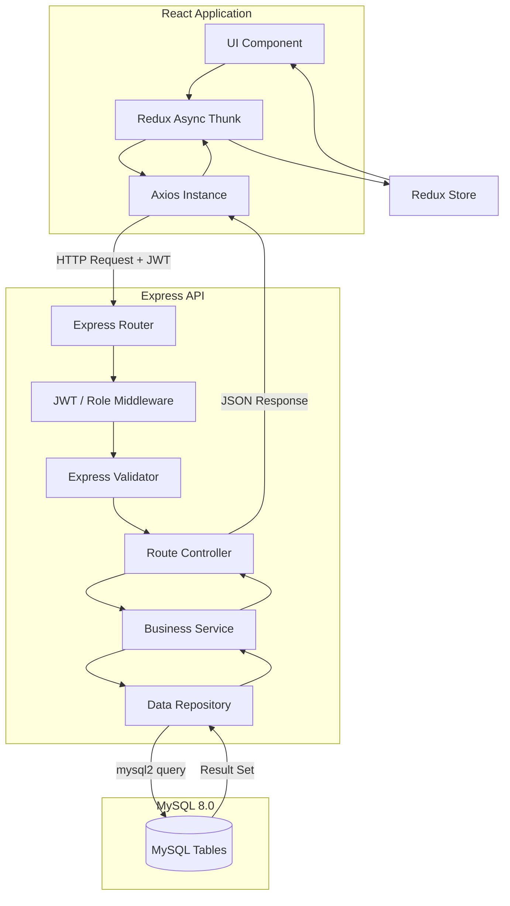
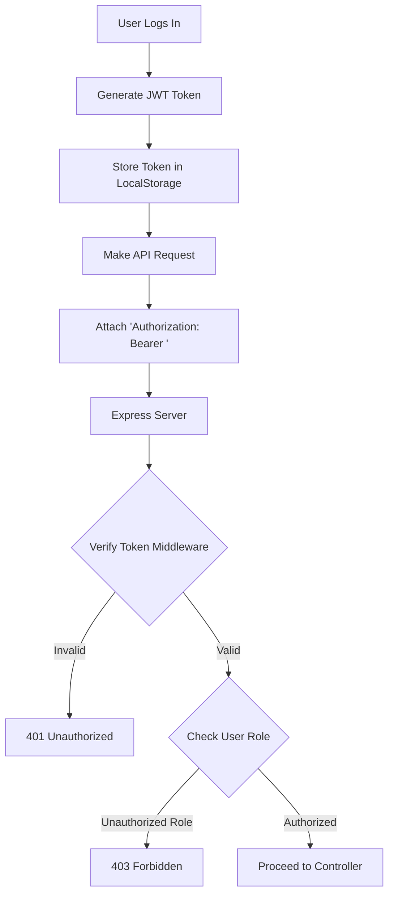
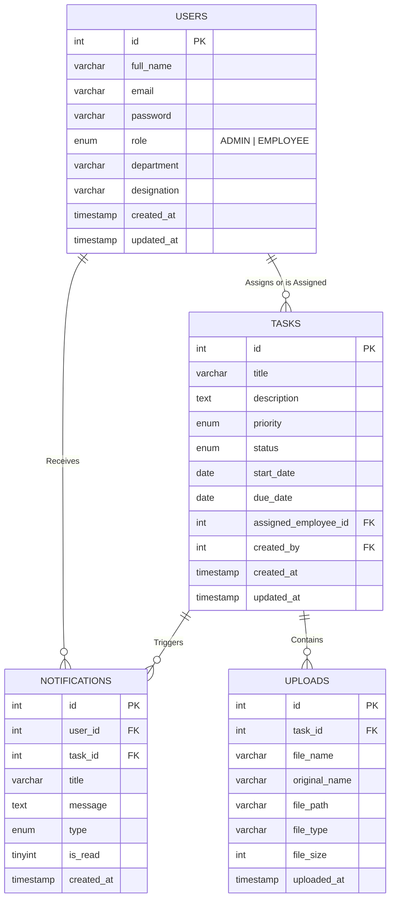

# Complete Project Architecture & Relationships

## 1. Request Lifecycle Architecture

```mermaid
graph TD
    subgraph Frontend [React Application]
        Component[UI Component] --> Action[Redux Async Thunk]
        Action --> Axios[Axios Instance]
    end
    
    subgraph Backend [Express API]
        Axios -- "HTTP Request + JWT" --> Route[Express Router]
        Route --> AuthMiddleware[JWT / Role Middleware]
        AuthMiddleware --> Validate[Express Validator]
        Validate --> Controller[Route Controller]
        Controller --> Service[Business Service]
        Service --> Repository[Data Repository]
    end
    
    subgraph Database [MySQL 8.0]
        Repository -- "mysql2 query" --> MySQL[(MySQL Tables)]
        MySQL -- "Result Set" --> Repository
    end
    
    Repository --> Service
    Service --> Controller
    Controller -- "JSON Response" --> Axios
    Axios --> Action
    Action --> Store[Redux Store]
    Store --> Component
```

## 2. Security & Authorization Flow

```mermaid
graph TD
    Login[User Logs In] --> Token[Generate JWT Token]
    Token --> Store[Store Token in LocalStorage]
    
    Store --> Request[Make API Request]
    Request --> Header[Attach 'Authorization: Bearer <token>']
    
    Header --> Server[Express Server]
    Server --> JWTCheck{Verify Token Middleware}
    
    JWTCheck -->|Invalid| 401[401 Unauthorized]
    JWTCheck -->|Valid| RoleCheck{Check User Role}
    
    RoleCheck -->|Unauthorized Role| 403[403 Forbidden]
    RoleCheck -->|Authorized| Access[Proceed to Controller]
```

## 3. Database Entity Relationship (ER) Diagram

```mermaid
erDiagram
    USERS {
        int id PK
        varchar full_name
        varchar email
        varchar password
        enum role "ADMIN | EMPLOYEE"
        varchar department
        varchar designation
        timestamp created_at
        timestamp updated_at
    }
    
    TASKS {
        int id PK
        varchar title
        text description
        enum priority
        enum status
        date start_date
        date due_date
        int assigned_employee_id FK
        int created_by FK
        timestamp created_at
        timestamp updated_at
    }
    
    NOTIFICATIONS {
        int id PK
        int user_id FK
        int task_id FK
        varchar title
        text message
        enum type
        tinyint is_read
        timestamp created_at
    }
    
    UPLOADS {
        int id PK
        int task_id FK
        varchar file_name
        varchar original_name
        varchar file_path
        varchar file_type
        int file_size
        timestamp uploaded_at
    }
    
    USERS ||--o{ TASKS : "Assigns or is Assigned"
    USERS ||--o{ NOTIFICATIONS : "Receives"
    TASKS ||--o{ NOTIFICATIONS : "Triggers"
    TASKS ||--o{ UPLOADS : "Contains"
```
